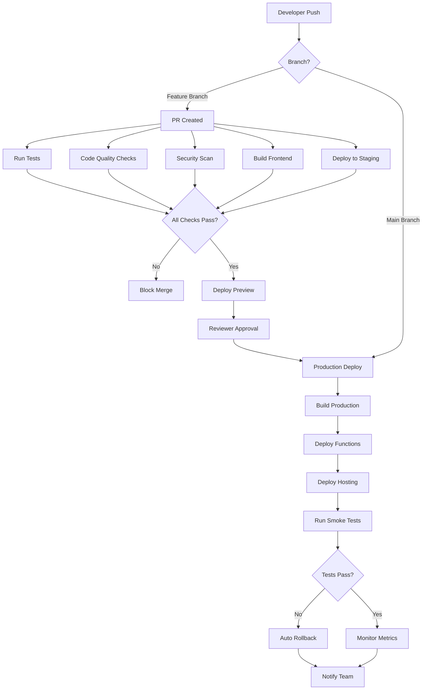

# 🔧 Build Pipeline Complete Audit & Recommendations
## Production-Ready CI/CD Analysis for Trade Hustle Resume Builder

**Date**: October 17, 2025  
**Repository**: tradehustle88/d3vtradehustle-resume-builder  
**Current Status**: 🟡 **BASIC DEPLOYMENT ONLY - NOT PRODUCTION-READY**  
**Pipeline Maturity**: Level 2 of 5 (Basic Automation)

---

## 📊 EXECUTIVE SUMMARY

Your current build pipeline has **minimal automation** - only basic Firebase Functions deployment on main branch pushes. You're missing **critical production-grade components** including testing, code quality checks, staging environments, monitoring, security scanning, and rollback mechanisms.

**Risk Assessment**: 🔴 HIGH - Direct-to-production deployments with no safety nets

**Current Pipeline Coverage**: ~15% of production requirements  
**Estimated Work**: 3-4 weeks to achieve production-ready status

---

## 🎯 CURRENT STATE ANALYSIS

### ✅ What You Have (The Good)

#### 1. **GitHub Actions Workflow** (.github/workflows/deploy.yml)
```yaml
- Node.js 20 setup with npm caching
- Firebase CLI deployment (functions only)
- Repository protection (tradehustle88/d3vtradehustle-resume-builder)
- Manual trigger support (workflow_dispatch)
```

**Strengths**:
- Basic CI/CD automation exists
- Uses modern Node 20 runtime
- Proper secret management (FIREBASE_TOKEN)

**Limitations**:
- Only deploys functions, not frontend
- No testing or validation steps
- No staging environment
- No rollback mechanism

---

#### 2. **Firebase Configuration**
```json
- Functions: Node.js 20 runtime
- Firestore: Rules and indexes configured
- Hosting: Static export from frontend/out
- Emulators: Local development setup
```

**Strengths**:
- Multi-service configuration (functions, firestore, hosting)
- Emulator support for local testing

**Limitations**:
- No multi-environment setup (dev/staging/prod)
- No performance budgets
- No custom headers configured
- Missing CDN configuration

---

#### 3. **Package Scripts**
```json
// Frontend
"dev", "build", "export", "lint", "type-check"

// Functions  
"lint", "serve", "deploy", "logs"
```

**Strengths**:
- TypeScript type checking available
- Linting configured

**Limitations**:
- No test scripts
- No pre-commit hooks
- No build verification
- No bundle analysis

---

#### 4. **Environment Configuration**
```
.env.example with 40+ variables documented
```

**Strengths**:
- Comprehensive environment template
- Firebase and GCP variables covered

**Limitations**:
- No environment validation script
- No secret rotation documentation
- No staging/production separation

---

## 🚨 CRITICAL MISSING COMPONENTS

### 1. **Automated Testing** ❌ BLOCKER
**Status**: No tests exist at all  
**Risk**: Bugs ship directly to production

**Missing**:
- Unit tests (Jest/Vitest)
- Integration tests
- End-to-end tests (Playwright/Cypress)
- API contract tests
- Load/performance tests

**Required Implementation**:

```bash
# Install testing dependencies
cd frontend
npm install --save-dev @testing-library/react @testing-library/jest-dom \
  @testing-library/user-event jest jest-environment-jsdom \
  @playwright/test

cd ../api-functions  
npm install --save-dev jest supertest @types/jest
```

**Create test structure**:
```
frontend/
  __tests__/
    components/
    pages/
    lib/
  e2e/
    auth.spec.ts
    templates.spec.ts
    unlock.spec.ts
  jest.config.js
  playwright.config.ts

api-functions/
  __tests__/
    unit/
      auth.test.js
      unlockResume.test.js
      editResume.test.js
    integration/
      api.integration.test.js
  jest.config.js
```

**Add to package.json**:
```json
{
  "scripts": {
    "test": "jest --coverage",
    "test:watch": "jest --watch",
    "test:e2e": "playwright test",
    "test:integration": "jest --testPathPattern=integration"
  }
}
```

**GitHub Actions Integration**:
```yaml
# .github/workflows/test.yml
name: Test Suite

on: [push, pull_request]

jobs:
  unit-tests:
    runs-on: ubuntu-latest
    steps:
      - uses: actions/checkout@v4
      - uses: actions/setup-node@v4
        with:
          node-version: '20'
      
      - name: Install Dependencies
        run: |
          cd frontend && npm ci
          cd ../api-functions && npm ci
      
      - name: Run Unit Tests
        run: |
          cd frontend && npm test
          cd ../api-functions && npm test
      
      - name: Upload Coverage
        uses: codecov/codecov-action@v3
        with:
          files: ./coverage/lcov.info
  
  e2e-tests:
    runs-on: ubuntu-latest
    steps:
      - uses: actions/checkout@v4
      - uses: actions/setup-node@v4
      
      - name: Install Playwright
        run: cd frontend && npx playwright install --with-deps
      
      - name: Run E2E Tests
        run: cd frontend && npm run test:e2e
      
      - name: Upload Test Results
        if: always()
        uses: actions/upload-artifact@v3
        with:
          name: playwright-report
          path: frontend/playwright-report/
```

**Coverage Requirements**:
- Unit tests: >80% coverage
- Critical paths (auth, payment): 100% coverage
- E2E tests: All user flows

---

### 2. **Code Quality Checks** ❌ BLOCKER
**Status**: Linting exists but not enforced in CI  
**Risk**: Style inconsistencies, potential bugs

**Missing**:
- Pre-commit hooks (Husky)
- Automatic formatting (Prettier)
- Type checking in CI
- Code complexity analysis
- Security linting (eslint-plugin-security)

**Implementation**:

```bash
# Install quality tools
npm install --save-dev husky lint-staged prettier \
  @typescript-eslint/eslint-plugin eslint-plugin-security \
  eslint-plugin-react-hooks
```

**Create .prettierrc**:
```json
{
  "semi": true,
  "trailingComma": "es5",
  "singleQuote": false,
  "printWidth": 100,
  "tabWidth": 2,
  "endOfLine": "lf"
}
```

**Create .lintstagedrc.json**:
```json
{
  "*.{js,jsx,ts,tsx}": [
    "eslint --fix",
    "prettier --write"
  ],
  "*.{json,md,css}": [
    "prettier --write"
  ]
}
```

**Setup Husky hooks**:
```bash
npx husky-init
npx husky set .husky/pre-commit "npx lint-staged"
npx husky set .husky/pre-push "npm run type-check && npm test"
```

**GitHub Actions Workflow**:
```yaml
# .github/workflows/quality.yml
name: Code Quality

on: [push, pull_request]

jobs:
  quality-checks:
    runs-on: ubuntu-latest
    steps:
      - uses: actions/checkout@v4
      
      - name: Run ESLint
        run: |
          cd frontend && npm run lint
          cd ../api-functions && npm run lint
      
      - name: Run TypeScript Check
        run: cd frontend && npm run type-check
      
      - name: Check Formatting
        run: npx prettier --check "**/*.{js,jsx,ts,tsx,json,md,css}"
      
      - name: Security Audit
        run: npm audit --audit-level=moderate
```

---

### 3. **Staging Environment** ❌ BLOCKER
**Status**: No staging/preview environments  
**Risk**: Cannot test changes before production

**Missing**:
- Separate Firebase project for staging
- Preview deployments for PRs
- Environment-specific configurations
- Smoke tests on staging

**Implementation**:

**Create Firebase Projects**:
```bash
# Development
firebase projects:create tradehustle-dev

# Staging
firebase projects:create tradehustle-staging

# Production (existing)
tradehustleresumebuilder
```

**Update .firebaserc**:
```json
{
  "projects": {
    "default": "tradehustleresumebuilder",
    "staging": "tradehustle-staging",
    "development": "tradehustle-dev"
  },
  "targets": {}
}
```

**Multi-Environment Workflow**:
```yaml
# .github/workflows/deploy-staging.yml
name: Deploy to Staging

on:
  pull_request:
    branches: [main]

jobs:
  deploy-staging:
    runs-on: ubuntu-latest
    steps:
      - uses: actions/checkout@v4
      
      - name: Build Frontend
        run: |
          cd frontend
          npm ci
          NEXT_PUBLIC_ENV=staging npm run build
      
      - name: Deploy to Firebase Staging
        env:
          FIREBASE_TOKEN: ${{ secrets.FIREBASE_TOKEN }}
        run: |
          firebase use staging
          firebase deploy --only hosting,functions
      
      - name: Comment PR with Preview URL
        uses: actions/github-script@v6
        with:
          script: |
            github.rest.issues.createComment({
              issue_number: context.issue.number,
              owner: context.repo.owner,
              repo: context.repo.repo,
              body: '🚀 Staging deployment ready!\n\nPreview: https://tradehustle-staging.web.app'
            })
      
      - name: Run Smoke Tests
        run: |
          npm install -g wait-on
          wait-on https://tradehustle-staging.web.app
          cd frontend && npm run test:e2e -- --config=playwright.staging.config.ts
```

**Environment-Specific Configs**:
```typescript
// frontend/src/config/env.ts
export const config = {
  development: {
    apiUrl: 'http://localhost:5001',
    firebase: { /* dev config */ }
  },
  staging: {
    apiUrl: 'https://us-central1-tradehustle-staging.cloudfunctions.net',
    firebase: { /* staging config */ }
  },
  production: {
    apiUrl: 'https://us-central1-tradehustleresumebuilder.cloudfunctions.net',
    firebase: { /* prod config */ }
  }
}[process.env.NEXT_PUBLIC_ENV || 'development'];
```

---

### 4. **Frontend Build Pipeline** ❌ BLOCKER
**Status**: Frontend not deployed via CI/CD  
**Risk**: Manual deployments prone to errors

**Missing**:
- Automated frontend build
- Bundle size monitoring
- Asset optimization
- Cache invalidation strategy

**Implementation**:

```yaml
# .github/workflows/deploy-frontend.yml
name: Deploy Frontend to Production

on:
  push:
    branches: [main]
    paths:
      - 'frontend/**'
  workflow_dispatch:

jobs:
  build-and-deploy:
    runs-on: ubuntu-latest
    steps:
      - uses: actions/checkout@v4
      
      - name: Setup Node.js
        uses: actions/setup-node@v4
        with:
          node-version: '20'
          cache: 'npm'
          cache-dependency-path: 'frontend/package-lock.json'
      
      - name: Install Dependencies
        run: cd frontend && npm ci
      
      - name: Build Frontend
        env:
          NEXT_PUBLIC_ENV: production
          NEXT_PUBLIC_FIREBASE_API_KEY: ${{ secrets.FIREBASE_API_KEY }}
          NEXT_PUBLIC_FIREBASE_AUTH_DOMAIN: ${{ secrets.FIREBASE_AUTH_DOMAIN }}
          NEXT_PUBLIC_FIREBASE_PROJECT_ID: ${{ secrets.FIREBASE_PROJECT_ID }}
          NEXT_PUBLIC_GA_MEASUREMENT_ID: ${{ secrets.GA_MEASUREMENT_ID }}
        run: |
          cd frontend
          npm run build
          npm run export
      
      - name: Analyze Bundle Size
        run: |
          cd frontend
          npx next-bundle-analyzer
      
      - name: Deploy to Firebase Hosting
        env:
          FIREBASE_TOKEN: ${{ secrets.FIREBASE_TOKEN }}
        run: firebase deploy --only hosting --project tradehustleresumebuilder
      
      - name: Verify Deployment
        run: |
          curl -f https://tradehustleresumebuilder.web.app || exit 1
      
      - name: Notify Deployment
        if: success()
        uses: actions/github-script@v6
        with:
          script: |
            github.rest.repos.createCommitStatus({
              owner: context.repo.owner,
              repo: context.repo.repo,
              sha: context.sha,
              state: 'success',
              description: 'Frontend deployed successfully',
              context: 'Firebase Hosting'
            })
```

**Bundle Analysis**:
```javascript
// frontend/next.config.js
const withBundleAnalyzer = require('@next/bundle-analyzer')({
  enabled: process.env.ANALYZE === 'true',
})

module.exports = withBundleAnalyzer({
  // existing config
  
  // Performance budgets
  webpack: (config, { isServer }) => {
    if (!isServer) {
      config.performance = {
        maxAssetSize: 500000, // 500 KB
        maxEntrypointSize: 500000,
        hints: 'warning',
      };
    }
    return config;
  },
});
```

---

### 5. **Security Scanning** ❌ CRITICAL
**Status**: No automated security checks  
**Risk**: Vulnerabilities shipped to production

**Missing**:
- Dependency vulnerability scanning
- Secret scanning
- SAST (Static Application Security Testing)
- Container scanning
- License compliance checks

**Implementation**:

```yaml
# .github/workflows/security.yml
name: Security Scanning

on:
  push:
    branches: [main, develop]
  pull_request:
  schedule:
    - cron: '0 2 * * 1' # Weekly on Mondays at 2 AM

jobs:
  dependency-check:
    runs-on: ubuntu-latest
    steps:
      - uses: actions/checkout@v4
      
      - name: Run npm audit
        run: |
          cd frontend && npm audit --audit-level=high
          cd ../api-functions && npm audit --audit-level=high
      
      - name: Snyk Security Scan
        uses: snyk/actions/node@master
        env:
          SNYK_TOKEN: ${{ secrets.SNYK_TOKEN }}
        with:
          command: test
          args: --severity-threshold=high
  
  secret-scanning:
    runs-on: ubuntu-latest
    steps:
      - uses: actions/checkout@v4
        with:
          fetch-depth: 0
      
      - name: TruffleHog Secret Scan
        uses: trufflesecurity/trufflehog@main
        with:
          path: ./
          base: ${{ github.event.repository.default_branch }}
          head: HEAD
  
  code-analysis:
    runs-on: ubuntu-latest
    steps:
      - uses: actions/checkout@v4
      
      - name: SonarCloud Scan
        uses: SonarSource/sonarcloud-github-action@master
        env:
          GITHUB_TOKEN: ${{ secrets.GITHUB_TOKEN }}
          SONAR_TOKEN: ${{ secrets.SONAR_TOKEN }}
        with:
          args: >
            -Dsonar.projectKey=tradehustle88_d3vtradehustle-resume-builder
            -Dsonar.organization=tradehustle88
            -Dsonar.javascript.lcov.reportPaths=coverage/lcov.info
            -Dsonar.coverage.exclusions=**/*.test.ts,**/*.spec.ts
  
  license-check:
    runs-on: ubuntu-latest
    steps:
      - uses: actions/checkout@v4
      
      - name: License Compliance Check
        run: |
          npx license-checker --production --summary \
            --failOn "GPL;AGPL;LGPL" \
            --exclude "MIT;Apache-2.0;BSD;ISC"
```

**GitHub Security Features to Enable**:
```bash
# Enable Dependabot
# Create .github/dependabot.yml
version: 2
updates:
  - package-ecosystem: "npm"
    directory: "/frontend"
    schedule:
      interval: "weekly"
    open-pull-requests-limit: 5
    
  - package-ecosystem: "npm"
    directory: "/api-functions"
    schedule:
      interval: "weekly"
```

**Branch Protection Rules**:
```
Settings → Branches → Branch protection rules for 'main':
☑ Require pull request reviews before merging (2 reviewers)
☑ Require status checks to pass before merging:
  - test-suite
  - code-quality
  - security-scan
  - build-frontend
☑ Require branches to be up to date before merging
☑ Require linear history
☑ Include administrators
```

---

### 6. **Monitoring & Observability** ❌ CRITICAL
**Status**: Basic console.log only  
**Risk**: No visibility into production issues

**Missing**:
- Error tracking (Sentry)
- Performance monitoring (APM)
- Uptime monitoring
- Log aggregation
- Real User Monitoring (RUM)
- Alerting system

**Implementation**:

**1. Error Tracking with Sentry**:
```bash
cd frontend
npm install @sentry/nextjs

cd ../api-functions
npm install @sentry/node
```

```javascript
// frontend/sentry.client.config.js
import * as Sentry from "@sentry/nextjs";

Sentry.init({
  dsn: process.env.NEXT_PUBLIC_SENTRY_DSN,
  environment: process.env.NEXT_PUBLIC_ENV || 'development',
  tracesSampleRate: 1.0,
  integrations: [
    new Sentry.BrowserTracing(),
    new Sentry.Replay({
      maskAllText: true,
      blockAllMedia: true,
    }),
  ],
  replaysSessionSampleRate: 0.1,
  replaysOnErrorSampleRate: 1.0,
});
```

```javascript
// api-functions/index.js
const Sentry = require("@sentry/node");

Sentry.init({
  dsn: process.env.SENTRY_DSN,
  environment: process.env.FIREBASE_CONFIG?.projectId || 'production',
  tracesSampleRate: 1.0,
});

// Wrap Express app
app.use(Sentry.Handlers.requestHandler());
app.use(Sentry.Handlers.tracingHandler());

// Error handler (must be last)
app.use(Sentry.Handlers.errorHandler());
```

**2. Application Performance Monitoring**:
```javascript
// frontend/src/lib/monitoring.ts
import { onCLS, onFID, onFCP, onLCP, onTTFB } from 'web-vitals';

function sendToAnalytics(metric: any) {
  // Send to Google Analytics
  if (window.gtag) {
    window.gtag('event', metric.name, {
      value: Math.round(metric.value),
      metric_id: metric.id,
      metric_value: metric.value,
      metric_delta: metric.delta,
    });
  }
  
  // Send to custom monitoring endpoint
  fetch('/api/vitals', {
    method: 'POST',
    headers: { 'Content-Type': 'application/json' },
    body: JSON.stringify(metric),
  });
}

export function reportWebVitals() {
  onCLS(sendToAnalytics);
  onFID(sendToAnalytics);
  onFCP(sendToAnalytics);
  onLCP(sendToAnalytics);
  onTTFB(sendToAnalytics);
}
```

**3. Structured Logging**:
```javascript
// api-functions/lib/logger.js
const { logger } = require('firebase-functions');

class Logger {
  info(message, metadata = {}) {
    logger.info(message, { ...metadata, timestamp: Date.now() });
  }
  
  error(message, error, metadata = {}) {
    logger.error(message, {
      error: {
        message: error.message,
        stack: error.stack,
        ...error
      },
      ...metadata,
      timestamp: Date.now()
    });
  }
  
  warn(message, metadata = {}) {
    logger.warn(message, { ...metadata, timestamp: Date.now() });
  }
}

module.exports = new Logger();
```

**4. Uptime Monitoring**:
```yaml
# .github/workflows/uptime-check.yml
name: Uptime Monitor

on:
  schedule:
    - cron: '*/5 * * * *' # Every 5 minutes

jobs:
  check:
    runs-on: ubuntu-latest
    steps:
      - name: Check Production API
        run: |
          response=$(curl -s -o /dev/null -w "%{http_code}" \
            https://us-central1-tradehustleresumebuilder.cloudfunctions.net/api/health)
          
          if [ $response -ne 200 ]; then
            echo "❌ API is down! Status: $response"
            exit 1
          fi
      
      - name: Check Frontend
        run: |
          response=$(curl -s -o /dev/null -w "%{http_code}" \
            https://tradehustleresumebuilder.web.app)
          
          if [ $response -ne 200 ]; then
            echo "❌ Frontend is down! Status: $response"
            exit 1
          fi
      
      - name: Alert on Failure
        if: failure()
        uses: 8398a7/action-slack@v3
        with:
          status: ${{ job.status }}
          text: '🚨 Production is down!'
          webhook_url: ${{ secrets.SLACK_WEBHOOK }}
```

**5. Firebase Monitoring Dashboard**:
```javascript
// Enable in Firebase Console:
- Performance Monitoring (frontend)
- Crashlytics (mobile, if applicable)
- Cloud Functions metrics
- Firestore usage metrics

// Add custom traces
import { trace } from 'firebase/performance';

const customTrace = trace(perf, 'resume_unlock_flow');
customTrace.start();
// ... user action
customTrace.stop();
```

---

### 7. **Rollback & Recovery** ❌ CRITICAL
**Status**: No rollback mechanism  
**Risk**: Stuck with broken deployments

**Missing**:
- Version tagging
- Automated rollback on failure
- Database migration rollback
- Blue-green deployments
- Canary releases

**Implementation**:

**1. Semantic Versioning**:
```yaml
# .github/workflows/release.yml
name: Create Release

on:
  push:
    branches: [main]

jobs:
  release:
    runs-on: ubuntu-latest
    steps:
      - uses: actions/checkout@v4
        with:
          fetch-depth: 0
      
      - name: Semantic Release
        uses: cycjimmy/semantic-release-action@v3
        env:
          GITHUB_TOKEN: ${{ secrets.GITHUB_TOKEN }}
        with:
          extra_plugins: |
            @semantic-release/changelog
            @semantic-release/git
      
      - name: Tag Docker Image
        run: |
          VERSION=$(cat package.json | jq -r .version)
          echo "VERSION=$VERSION" >> $GITHUB_ENV
      
      - name: Create GitHub Release
        uses: actions/create-release@v1
        env:
          GITHUB_TOKEN: ${{ secrets.GITHUB_TOKEN }}
        with:
          tag_name: v${{ env.VERSION }}
          release_name: Release v${{ env.VERSION }}
          body: Auto-generated release from CI/CD pipeline
```

**2. Automated Rollback**:
```yaml
# .github/workflows/deploy-with-rollback.yml
name: Deploy with Rollback Support

on:
  push:
    branches: [main]

jobs:
  deploy:
    runs-on: ubuntu-latest
    steps:
      - uses: actions/checkout@v4
      
      - name: Get Previous Version
        id: prev_version
        run: |
          PREV_SHA=$(git rev-parse HEAD~1)
          echo "prev_sha=$PREV_SHA" >> $GITHUB_OUTPUT
      
      - name: Deploy to Production
        id: deploy
        run: |
          cd frontend && npm run build
          firebase deploy --only hosting,functions
      
      - name: Run Health Checks
        id: health_check
        run: |
          sleep 30 # Wait for deployment to stabilize
          
          # Check API health
          API_STATUS=$(curl -s -o /dev/null -w "%{http_code}" \
            https://us-central1-tradehustleresumebuilder.cloudfunctions.net/api/health)
          
          # Check frontend
          WEB_STATUS=$(curl -s -o /dev/null -w "%{http_code}" \
            https://tradehustleresumebuilder.web.app)
          
          if [ $API_STATUS -ne 200 ] || [ $WEB_STATUS -ne 200 ]; then
            echo "Health check failed!"
            exit 1
          fi
      
      - name: Rollback on Failure
        if: failure() && steps.deploy.outcome == 'success'
        run: |
          echo "🔄 Rolling back to previous version..."
          git checkout ${{ steps.prev_version.outputs.prev_sha }}
          cd frontend && npm run build
          firebase deploy --only hosting,functions --force
          
          echo "✅ Rollback complete"
      
      - name: Notify Team
        if: always()
        uses: 8398a7/action-slack@v3
        with:
          status: ${{ job.status }}
          text: |
            Deployment ${{ job.status }}
            Commit: ${{ github.sha }}
          webhook_url: ${{ secrets.SLACK_WEBHOOK }}
```

**3. Firebase Hosting Rollback**:
```bash
# Manual rollback command (document in runbook)
firebase hosting:channel:deploy preview-$GITHUB_SHA --expires 7d
firebase hosting:clone SOURCE_SITE:SOURCE_CHANNEL SITE:live
firebase hosting:rollback # Goes to previous release
```

**4. Database Migration Safety**:
```javascript
// api-functions/migrations/migrate.js
const admin = require('firebase-admin');

class Migration {
  constructor(version, up, down) {
    this.version = version;
    this.up = up;
    this.down = down;
  }
  
  async run() {
    const db = admin.firestore();
    const migrationDoc = db.collection('_migrations').doc(this.version);
    
    const exists = await migrationDoc.get();
    if (exists.exists) {
      console.log(`Migration ${this.version} already applied`);
      return;
    }
    
    try {
      await this.up();
      await migrationDoc.set({
        version: this.version,
        appliedAt: admin.firestore.FieldValue.serverTimestamp()
      });
      console.log(`✅ Migration ${this.version} applied`);
    } catch (error) {
      console.error(`❌ Migration ${this.version} failed:`, error);
      throw error;
    }
  }
  
  async rollback() {
    await this.down();
    await admin.firestore()
      .collection('_migrations')
      .doc(this.version)
      .delete();
    console.log(`🔄 Migration ${this.version} rolled back`);
  }
}

// Example migration
const migration_001 = new Migration(
  '001_add_subscription_field',
  async () => {
    // Forward migration
    const users = await admin.firestore().collection('users').get();
    const batch = admin.firestore().batch();
    users.docs.forEach(doc => {
      batch.update(doc.ref, { subscriptionTier: 'free' });
    });
    await batch.commit();
  },
  async () => {
    // Rollback
    const users = await admin.firestore().collection('users').get();
    const batch = admin.firestore().batch();
    users.docs.forEach(doc => {
      batch.update(doc.ref, { subscriptionTier: admin.firestore.FieldValue.delete() });
    });
    await batch.commit();
  }
);

module.exports = { Migration, migrations: [migration_001] };
```

---

### 8. **Performance Optimization** ❌ HIGH PRIORITY
**Status**: No build-time optimization  
**Risk**: Slow page loads, poor Core Web Vitals

**Missing**:
- Bundle size tracking
- Image optimization pipeline
- Code splitting analysis
- Lighthouse CI
- CDN configuration

**Implementation**:

**1. Lighthouse CI**:
```yaml
# .github/workflows/lighthouse.yml
name: Lighthouse CI

on:
  pull_request:
  push:
    branches: [main]

jobs:
  lighthouse:
    runs-on: ubuntu-latest
    steps:
      - uses: actions/checkout@v4
      
      - name: Build Site
        run: |
          cd frontend
          npm ci
          npm run build
      
      - name: Run Lighthouse CI
        uses: treosh/lighthouse-ci-action@v9
        with:
          urls: |
            https://tradehustleresumebuilder.web.app
            https://tradehustleresumebuilder.web.app/templates
            https://tradehustleresumebuilder.web.app/unlock
          uploadArtifacts: true
          temporaryPublicStorage: true
          budgetPath: ./lighthouse-budget.json
      
      - name: Fail on Poor Performance
        run: |
          # Fail if performance score < 90
          score=$(cat lhci_reports/manifest.json | jq '.[0].summary.performance')
          if [ $(echo "$score < 0.9" | bc) -eq 1 ]; then
            echo "❌ Performance score too low: $score"
            exit 1
          fi
```

**lighthouse-budget.json**:
```json
[
  {
    "path": "/*",
    "resourceSizes": [
      {
        "resourceType": "script",
        "budget": 300
      },
      {
        "resourceType": "stylesheet",
        "budget": 50
      },
      {
        "resourceType": "image",
        "budget": 200
      },
      {
        "resourceType": "total",
        "budget": 600
      }
    ],
    "timings": [
      {
        "metric": "interactive",
        "budget": 3000
      },
      {
        "metric": "first-contentful-paint",
        "budget": 1500
      }
    ]
  }
]
```

**2. Bundle Analysis**:
```bash
npm install --save-dev @next/bundle-analyzer

# Add to package.json
"analyze": "ANALYZE=true npm run build"
```

**3. Image Optimization CI**:
```yaml
# .github/workflows/optimize-images.yml
name: Optimize Images

on:
  pull_request:
    paths:
      - 'frontend/public/**/*.png'
      - 'frontend/public/**/*.jpg'

jobs:
  optimize:
    runs-on: ubuntu-latest
    steps:
      - uses: actions/checkout@v4
      
      - name: Compress Images
        uses: calibreapp/image-actions@main
        with:
          githubToken: ${{ secrets.GITHUB_TOKEN }}
          compressOnly: true
```

---

### 9. **Documentation & Runbooks** ❌ HIGH PRIORITY
**Status**: No operational documentation  
**Risk**: Incidents take longer to resolve

**Missing**:
- Deployment runbook
- Incident response playbook
- Architecture diagrams
- API documentation
- Rollback procedures

**Create Operations Documentation**:

```markdown
# docs/operations/DEPLOYMENT_RUNBOOK.md

## Deployment Procedures

### Pre-Deployment Checklist
- [ ] All tests passing
- [ ] Security scan clean
- [ ] Staging deployment successful
- [ ] Backup database
- [ ] Notify team in #deployments Slack channel

### Production Deployment Steps
1. Merge PR to main branch
2. CI/CD auto-triggers deployment
3. Monitor Firebase Console for errors
4. Run smoke tests: `npm run test:smoke:prod`
5. Check Sentry for new errors
6. Verify Core Web Vitals in Google Analytics

### Rollback Procedures
If deployment fails:
1. Run: `firebase hosting:rollback`
2. Check out previous commit: `git checkout HEAD~1`
3. Redeploy functions: `firebase deploy --only functions --force`
4. Notify team and create incident ticket

### Emergency Contacts
- On-call Engineer: [Phone]
- Firebase Support: support.firebase.google.com
- Sentry Alerts: #sentry-alerts Slack channel
```

```markdown
# docs/operations/INCIDENT_RESPONSE.md

## Incident Response Playbook

### Severity Levels
- **P0 (Critical)**: Site down, payment processing broken
- **P1 (High)**: Major feature broken, affecting >50% users
- **P2 (Medium)**: Minor feature broken, affecting <50% users
- **P3 (Low)**: Cosmetic issue, no functionality impact

### P0 Response (Site Down)
1. **Alert Team** (5 min)
   - Post in #incidents Slack channel
   - Page on-call engineer
   
2. **Assess Impact** (10 min)
   - Check Firebase Console for errors
   - Review Sentry error spikes
   - Check uptime monitor status
   
3. **Immediate Mitigation** (15 min)
   - If recent deployment: Rollback immediately
   - If database issue: Enable maintenance mode
   - If traffic spike: Scale up Cloud Functions
   
4. **Root Cause Investigation** (30 min)
   - Check recent commits
   - Review function logs
   - Analyze error patterns
   
5. **Permanent Fix** (variable)
   - Deploy hotfix to production
   - Run full test suite
   - Monitor for 30 minutes
   
6. **Post-Incident Review** (within 24 hours)
   - Create incident report
   - Document lessons learned
   - Update runbooks
```

---

### 10. **Dependency Management** ❌ MEDIUM PRIORITY
**Status**: Manual npm updates  
**Risk**: Security vulnerabilities, breaking changes

**Missing**:
- Automated dependency updates
- Breaking change detection
- License compliance checks
- Deprecated package warnings

**Implementation**:

```yaml
# .github/dependabot.yml
version: 2
updates:
  # Frontend dependencies
  - package-ecosystem: "npm"
    directory: "/frontend"
    schedule:
      interval: "weekly"
      day: "monday"
      time: "09:00"
    open-pull-requests-limit: 5
    reviewers:
      - "tradehustle88"
    assignees:
      - "tradehustle88"
    commit-message:
      prefix: "chore(deps)"
    labels:
      - "dependencies"
      - "automerge"
    versioning-strategy: increase
    
  # Functions dependencies
  - package-ecosystem: "npm"
    directory: "/api-functions"
    schedule:
      interval: "weekly"
      day: "monday"
      time: "09:00"
    open-pull-requests-limit: 5
    
  # GitHub Actions
  - package-ecosystem: "github-actions"
    directory: "/"
    schedule:
      interval: "weekly"
```

**Auto-merge safe updates**:
```yaml
# .github/workflows/auto-merge-dependabot.yml
name: Auto-merge Dependabot PRs

on:
  pull_request:
    branches: [main]

jobs:
  auto-merge:
    runs-on: ubuntu-latest
    if: github.actor == 'dependabot[bot]'
    steps:
      - name: Check if tests passed
        run: |
          # Wait for status checks
          gh pr checks ${{ github.event.pull_request.number }} --watch
        env:
          GITHUB_TOKEN: ${{ secrets.GITHUB_TOKEN }}
      
      - name: Enable auto-merge for patch/minor updates
        run: |
          PR_TITLE="${{ github.event.pull_request.title }}"
          if [[ "$PR_TITLE" =~ "patch" || "$PR_TITLE" =~ "minor" ]]; then
            gh pr merge ${{ github.event.pull_request.number }} \
              --auto --squash
          fi
        env:
          GITHUB_TOKEN: ${{ secrets.GITHUB_TOKEN }}
```

---

## 🔄 COMPLETE CI/CD PIPELINE ARCHITECTURE

### Recommended End-to-End Flow



---

## 📦 ADDITIONAL TOOLING RECOMMENDATIONS

### 1. **Feature Flag System**
```bash
npm install @vercel/flags launchdarkly-js-client-sdk
```

**Use cases**:
- Gradual rollout of new features
- A/B testing
- Kill switch for problematic features
- Beta access control

---

### 2. **Database Backup Automation**
```yaml
# .github/workflows/backup-firestore.yml
name: Backup Firestore

on:
  schedule:
    - cron: '0 3 * * *' # Daily at 3 AM

jobs:
  backup:
    runs-on: ubuntu-latest
    steps:
      - name: Export Firestore Data
        run: |
          gcloud firestore export gs://tradehustle-backups/$(date +%Y-%m-%d) \
            --project=tradehustleresumebuilder
        env:
          GOOGLE_APPLICATION_CREDENTIALS: ${{ secrets.GCP_SA_KEY }}
      
      - name: Verify Backup
        run: |
          gsutil ls gs://tradehustle-backups/$(date +%Y-%m-%d)
```

---

### 3. **Load Testing**
```javascript
// k6-load-test.js
import http from 'k6/http';
import { check, sleep } from 'k6';

export const options = {
  stages: [
    { duration: '2m', target: 100 }, // Ramp up to 100 users
    { duration: '5m', target: 100 }, // Stay at 100 users
    { duration: '2m', target: 0 },   // Ramp down
  ],
  thresholds: {
    http_req_duration: ['p(95)<500'], // 95% of requests under 500ms
    http_req_failed: ['rate<0.01'],   // Error rate under 1%
  },
};

export default function () {
  const res = http.get('https://tradehustleresumebuilder.web.app');
  check(res, {
    'status is 200': (r) => r.status === 200,
    'page loaded': (r) => r.body.includes('Trade Hustle'),
  });
  sleep(1);
}
```

```yaml
# Run in CI
- name: Load Test
  run: |
    docker run --rm grafana/k6 run - <k6-load-test.js
```

---

### 4. **API Contract Testing**
```bash
npm install --save-dev dredd
```

```yaml
# api-blueprint.apib
FORMAT: 1A

# Trade Hustle API

## Unlock Resume [/api/unlockResume]

### Unlock Resume [POST]

+ Request (application/json)
    + Headers
            Authorization: Bearer {token}
    
    + Body
            {
                "company": ""
            }

+ Response 200 (application/json)
    + Body
            {
                "success": true,
                "message": "Resume unlocked successfully"
            }
```

```yaml
# Run in CI
- name: API Contract Tests
  run: dredd api-blueprint.apib https://staging.tradehustle.com
```

---

## 🎯 IMPLEMENTATION PRIORITY MATRIX

| Priority | Component | Impact | Effort | Timeline |
|----------|-----------|--------|--------|----------|
| 🔴 P0 | Automated Testing | High | High | Week 1-2 |
| 🔴 P0 | Staging Environment | High | Medium | Week 1 |
| 🔴 P0 | Frontend CI/CD | High | Medium | Week 1 |
| 🟠 P1 | Security Scanning | High | Low | Week 2 |
| 🟠 P1 | Error Monitoring | High | Low | Week 2 |
| 🟠 P1 | Code Quality Checks | Medium | Low | Week 2 |
| 🟡 P2 | Rollback Automation | Medium | Medium | Week 3 |
| 🟡 P2 | Performance Monitoring | Medium | Medium | Week 3 |
| 🟢 P3 | Load Testing | Low | Medium | Week 4 |
| 🟢 P3 | Feature Flags | Low | Low | Week 4 |

---

## 📊 SUCCESS METRICS

### Pipeline Health KPIs

| Metric | Current | Target | Timeframe |
|--------|---------|--------|-----------|
| **Deployment Frequency** | Manual | 5+ per week | 1 month |
| **Lead Time for Changes** | Hours | <30 min | 2 months |
| **Mean Time to Recovery** | Unknown | <1 hour | 1 month |
| **Change Failure Rate** | Unknown | <5% | 2 months |
| **Test Coverage** | 0% | >80% | 1 month |
| **Build Success Rate** | ~60% | >95% | 1 month |
| **Security Scan Failures** | Unknown | 0 | Ongoing |

---

## 🚀 QUICK WINS (Start This Week)

### Week 1 Checklist
- [ ] Add basic Jest tests for critical functions (auth, unlock, edit)
- [ ] Set up Dependabot for automated security updates
- [ ] Enable GitHub branch protection rules
- [ ] Add Prettier + Husky pre-commit hooks
- [ ] Create staging Firebase project
- [ ] Set up Sentry error tracking (free tier)
- [ ] Document deployment runbook
- [ ] Add frontend build step to CI/CD
- [ ] Create .env.example with all required variables
- [ ] Add bundle size monitoring

### Week 2 Checklist
- [ ] Implement E2E tests with Playwright (critical paths)
- [ ] Add security scanning (npm audit, Snyk free tier)
- [ ] Set up staging deployment workflow
- [ ] Configure automated rollback on health check failure
- [ ] Add Lighthouse CI for performance tracking
- [ ] Create incident response playbook
- [ ] Set up uptime monitoring (UptimeRobot free tier)
- [ ] Add structured logging throughout codebase
- [ ] Configure Firebase Performance Monitoring
- [ ] Add smoke tests to deployment pipeline

---

## 💰 ESTIMATED COSTS

### Tooling Budget (Monthly)

| Tool | Purpose | Cost |
|------|---------|------|
| **Sentry** | Error tracking | $26/mo (Team plan) |
| **Codecov** | Test coverage | Free (open source) |
| **Snyk** | Security scanning | $0-99/mo |
| **UptimeRobot** | Uptime monitoring | Free (50 monitors) |
| **GitHub Actions** | CI/CD minutes | $0 (2000 min/mo free) |
| **Firebase Staging** | Test environment | ~$25/mo |
| **SonarCloud** | Code quality | Free (open source) |
| **LaunchDarkly** | Feature flags | $0-20/mo |
| **Total** | | **~$75-150/month** |

---

## 📚 RECOMMENDED RESOURCES

### Learning Materials
- [Firebase CI/CD Best Practices](https://firebase.google.com/docs/hosting/github-integration)
- [Next.js Deployment](https://nextjs.org/docs/deployment)
- [GitHub Actions Workflow Syntax](https://docs.github.com/en/actions/reference/workflow-syntax-for-github-actions)
- [Jest Testing Framework](https://jestjs.io/docs/getting-started)
- [Playwright E2E Testing](https://playwright.dev/docs/intro)
- [Sentry Next.js Integration](https://docs.sentry.io/platforms/javascript/guides/nextjs/)

### Templates & Examples
- [Next.js + Firebase Example](https://github.com/vercel/next.js/tree/canary/examples/with-firebase)
- [GitHub Actions for Firebase](https://github.com/marketplace/actions/github-action-for-firebase)
- [E2E Testing Patterns](https://github.com/microsoft/playwright/tree/main/examples)

---

## ✅ FINAL RECOMMENDATIONS

### Must-Have (Production Blockers)
1. **Set up automated testing** - No production deployment without tests
2. **Create staging environment** - Never deploy directly to production
3. **Implement error monitoring** - You need visibility into production issues
4. **Add security scanning** - Prevent vulnerabilities from shipping
5. **Configure automated rollbacks** - Reduce MTTR for incidents

### Should-Have (Operational Excellence)
6. Set up performance monitoring and alerts
7. Implement pre-commit hooks for code quality
8. Add load testing to prevent scalability issues
9. Document deployment procedures and incident response
10. Configure dependency automation (Dependabot)

### Nice-to-Have (Optimization)
11. Implement feature flags for gradual rollouts
12. Add API contract testing
13. Set up multi-region deployment
14. Implement canary releases
15. Add cost monitoring and optimization

---

## 🎯 NEXT STEPS

1. **Review this audit with your team** - Prioritize based on your risk tolerance
2. **Start with Quick Wins** - Get momentum with low-effort, high-impact changes
3. **Create Jira/Linear tickets** - Break down work into actionable tasks
4. **Set up staging environment** - Foundation for safe deployments
5. **Implement test framework** - Start with critical path tests
6. **Schedule weekly pipeline reviews** - Continuously improve your CI/CD maturity

---

**Questions? Need help implementing any of these recommendations?**

Let me know which area you'd like to prioritize first!
