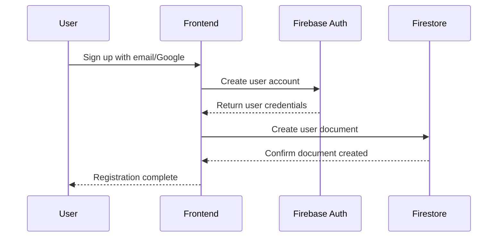
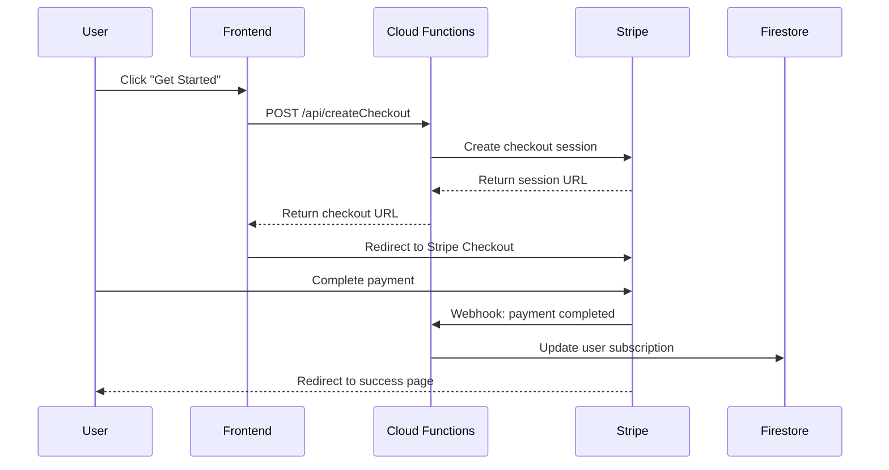
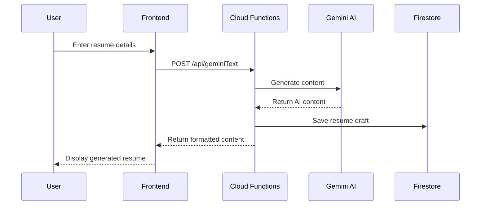

# 💻 Trade Hustle Resume Builder - Codebase Briefing Document

**Document Version:** 1.0  
**Date:** October 13, 2025  
**Last Updated:** Real-time  
**Repository:** [d3vtradehustle-resume-builder](https://github.com/tradehustle88/d3vtradehustle-resume-builder)

---

## 🏗️ Architecture Overview

### **System Architecture Diagram**

```
┌─────────────────┐    ┌─────────────────┐    ┌─────────────────┐
│   Frontend      │    │   Backend       │    │   External      │
│   (Next.js)     │    │   (Firebase)    │    │   Services      │
└─────────────────┘    └─────────────────┘    └─────────────────┘
         │                       │                       │
    ┌─────────┐              ┌─────────┐              ┌─────────┐
    │ React   │              │Functions│              │ Stripe  │
    │ Components              │ (Node.js)              │ Payment │
    └─────────┘              └─────────┘              └─────────┘
         │                       │                       │
    ┌─────────┐              ┌─────────┐              ┌─────────┐
    │Tailwind │              │Firestore│              │ Gemini  │
    │   CSS   │              │Database │              │   AI    │
    └─────────┘              └─────────┘              └─────────┘
```

### **Technology Stack Summary**

| Layer | Technology | Version | Purpose |
|-------|------------|---------|---------|
| **Frontend** | Next.js | 14.2.5 | React framework with App Router |
| **UI Library** | React | 18.3.1 | Component-based UI |
| **Styling** | Tailwind CSS | 3.4.1 | Utility-first CSS framework |
| **Language** | TypeScript | 5.9.2 | Type-safe JavaScript |
| **Backend** | Firebase Functions | v6.x | Serverless backend |
| **Database** | Firestore | Latest | NoSQL document database |
| **Authentication** | Firebase Auth | Latest | User authentication |
| **Payments** | Stripe | v16.x | Payment processing |
| **AI** | Vertex AI/Gemini | 2.5 Flash | Content generation |
| **Hosting** | Firebase Hosting | Latest | Static site hosting |

---

## 📁 Project Structure

### **Root Directory Structure**
```
d3vtradehustle-resume-builder/
├── 📂 frontend/                    # Next.js application
├── 📂 api-functions/              # Firebase Functions
├── 📂 docs/                       # Project documentation
├── 📂 public/                     # Static assets (root)
├── 📂 scripts/                    # Build and deployment scripts
├── 📄 firebase.json               # Firebase configuration
├── 📄 .firebaserc                 # Firebase project settings
├── 📄 README.md                   # Project overview
└── 📄 package.json                # Root dependencies
```

### **Frontend Application Structure (`/frontend/`)**
```
frontend/
├── 📂 public/                     # Static assets
│   ├── 📂 assets/                 # Images, icons, fonts
│   │   ├── 📂 paint-splatters/    # Paint effect images
│   │   ├── 📄 brick-bg-v3.webp    # Brick wall texture
│   │   └── 📄 resumeBuilderLogo-v3.png
│   └── 📂 icons/                  # Social media icons
│       ├── 📄 linkedin.png
│       ├── 📄 instagram.png
│       ├── 📄 facebook.png
│       ├── 📄 tiktok.png
│       ├── 📄 indeed.png
│       └── 📄 pinterest.png
├── 📂 src/
│   ├── 📂 app/                    # Next.js App Router
│   │   ├── 📄 layout.tsx          # Root layout component
│   │   ├── 📄 page.tsx            # Homepage
│   │   ├── 📄 globals.css         # Global styles
│   │   ├── 📂 pricing/            # Pricing page
│   │   └── 📂 success/            # Payment success page
│   ├── 📂 components/             # React components
│   │   ├── 📄 LandingPage.tsx     # Main landing page
│   │   ├── 📄 PaintSplatter.tsx   # Paint effect component
│   │   ├── 📄 SocialBar.tsx       # Social media icons
│   │   └── 📄 Footer.tsx          # Site footer
│   ├── 📂 lib/                    # Utility libraries
│   │   ├── 📄 firebase.ts         # Firebase client config
│   │   └── 📄 api.ts              # API utilities
│   └── 📂 styles/                 # Additional stylesheets
│       └── 📄 paint-splatters.css # Paint effect styles
├── 📄 next.config.js              # Next.js configuration
├── 📄 tailwind.config.js          # Tailwind CSS config
├── 📄 tsconfig.json               # TypeScript config
├── 📄 package.json                # Frontend dependencies
└── 📄 .env.local                  # Environment variables
```

### **Backend Functions Structure (`/api-functions/`)**
```
api-functions/
├── 📄 index.js                    # Main functions entry point
├── 📄 config.js                   # Configuration and secrets
├── 📄 package.json                # Backend dependencies
└── 📄 README.md                   # Backend documentation
```

---

## 🔧 Core Components Deep Dive

### **Frontend Components**

#### **1. LandingPage.tsx** - Main Landing Component
```typescript
Location: /frontend/src/components/LandingPage.tsx
Purpose: Primary landing page with hero section
Key Features:
- Trade Hustle branding and typography
- Paint splatter background effects
- Logo display with animation
- Call-to-action buttons
- Responsive design for mobile/desktop

Dependencies:
- Next.js Image component
- Link component for navigation
- PaintSplatter component for effects
- SimpleAIAssistant component
```

#### **2. PaintSplatter.tsx** - Visual Effects Component
```typescript
Location: /frontend/src/components/PaintSplatter.tsx
Purpose: Animated paint splatter background effects
Key Features:
- 9 different paint splatter variations
- Size controls (sm, md, lg, xl)
- Position presets (corners, center)
- Animation types (float, pulse, fade-in)
- Preset configurations for common layouts

Props Interface:
type: 'blue' | 'yellow' | 'red' | 'multicolor' | 'drops' | 'spray-1' | 'spray-2'
size?: 'sm' | 'md' | 'lg' | 'xl'
position?: 'top-left' | 'top-right' | 'bottom-left' | 'bottom-right' | 'center'
animation?: 'float' | 'pulse' | 'fade-in' | 'hover' | 'none'
```

#### **3. SocialBar.tsx** - Social Media Integration
```typescript
Location: /frontend/src/components/SocialBar.tsx
Purpose: Social media icons with golden coin styling
Platforms:
- LinkedIn: /company/tradehustle
- Instagram: /tradehustle
- TikTok: /@tradehustle
- Facebook: /tradehustle
- Indeed: /cmp/tradehustle
- Pinterest: /tradehustle

Features:
- Golden metallic gradient design
- Hover animations and shadow effects
- Accessibility compliance (ARIA labels)
- External link handling (target="_blank")
```

### **Backend Functions**

#### **1. createCheckout** - Stripe Payment Processing
```javascript
Location: /api-functions/index.js
Purpose: Create Stripe checkout sessions
Flow:
1. Validate request parameters
2. Create Stripe checkout session
3. Configure success/cancel URLs
4. Return session URL for redirect

Security:
- Rate limiting (30 requests/minute)
- Honeypot protection
- CORS configuration
- Error handling with sanitized responses
```

#### **2. stripeWebhook** - Payment Verification
```javascript
Purpose: Handle Stripe webhook events
Events Processed:
- checkout.session.completed
- payment_intent.succeeded
- invoice.payment_failed

Security:
- Webhook signature verification
- Idempotency handling
- Error logging and monitoring
```

#### **3. geminiText** - AI Content Generation
```javascript
Purpose: Generate resume content using Gemini AI
Features:
- Text-based resume generation
- Industry-specific prompts
- Error fallback handling
- Response sanitization

Model: gemini-2.0-flash-lite-001
Parameters:
- Temperature: 0.7 (creative but focused)
- Max output tokens: 2048
- Safety settings: High filter level
```

#### **4. geminiImage** - AI Image Processing
```javascript
Purpose: Process images with Gemini Vision
Features:
- Image analysis and description
- Content moderation
- Multi-format support (JPEG, PNG, WebP)

Model: gemini-2.5-flash-image-001
Capabilities:
- Image understanding
- Text extraction from images
- Visual content analysis
```

---

## 🎨 Styling & Design System

### **Design Tokens**

#### **Color Palette**
```css
/* Brand Colors */
--hustle-red: #E50914;        /* Primary brand color */
--hustle-gold: #ffd700;       /* Secondary accent */
--hustle-dark-red: #8B0000;   /* Dark variant */
--hustle-blue: #1673FF;       /* Electric blue accent */

/* Neutral Colors */
--black: #000000;             /* Primary background */
--white: #ffffff;             /* Primary text on dark */
--gray-100: #f3f4f6;          /* Light gray */
--gray-300: #d1d5db;          /* Medium gray */
--gray-700: #374151;          /* Dark gray */
```

#### **Typography**
```css
/* Font Families */
--font-primary: 'Anton', sans-serif;        /* Headers, bold text */
--font-secondary: 'Merriweather', serif;    /* Body text, readable */

/* Font Sizes */
--text-xs: 0.75rem;           /* 12px */
--text-sm: 0.875rem;          /* 14px */
--text-base: 1rem;            /* 16px */
--text-lg: 1.125rem;          /* 18px */
--text-xl: 1.25rem;           /* 20px */
--text-2xl: 1.5rem;           /* 24px */
--text-4xl: 2.25rem;          /* 36px */
--text-6xl: 3.75rem;          /* 60px */
```

#### **Spacing System**
```css
/* Tailwind CSS spacing scale */
--space-1: 0.25rem;           /* 4px */
--space-2: 0.5rem;            /* 8px */
--space-4: 1rem;              /* 16px */
--space-6: 1.5rem;            /* 24px */
--space-8: 2rem;              /* 32px */
--space-12: 3rem;             /* 48px */
--space-16: 4rem;             /* 64px */
```

### **Component Styling Patterns**

#### **Button Styles**
```css
/* Primary CTA Button */
.btn-hustle {
  @apply bg-gradient-to-r from-[#E50914] to-[#8B0000];
  @apply hover:from-[#FF1B2D] hover:to-[#A0001B];
  @apply text-white font-bold py-4 px-12 rounded-lg;
  @apply transition-all duration-300 shadow-2xl;
  @apply transform hover:scale-105;
  @apply hover:shadow-[0_0_30px_rgba(229,9,20,0.6)];
}

/* Secondary Button */
.btn-secondary {
  @apply bg-transparent border-2 border-[#ffd700];
  @apply text-[#ffd700] hover:bg-[#ffd700] hover:text-black;
  @apply font-bold py-4 px-8 rounded-lg;
  @apply transition-all duration-300;
}
```

#### **Card Components**
```css
/* Brick-style Card */
.brick-block {
  @apply bg-gradient-to-b from-[#111] to-[#222];
  @apply border border-gray-700 rounded-xl shadow-xl;
  @apply p-8 text-center relative overflow-hidden;
}

/* Overlay for brick texture */
.brick-block-overlay {
  @apply relative;
  background-image: url('/assets/brick-bg-v3.webp');
  background-size: cover;
  background-position: center;
}
```

### **Animation Classes**

#### **Paint Splatter Animations**
```css
/* Floating Animation */
@keyframes paintFloat {
  0%, 100% {
    transform: translateY(0px) rotate(0deg);
  }
  50% {
    transform: translateY(-10px) rotate(2deg);
  }
}

.paint-splatter-float {
  animation: paintFloat 6s ease-in-out infinite;
}

/* Pulse Animation */
@keyframes paintPulse {
  0%, 100% {
    opacity: 0.6;
    transform: scale(1);
  }
  50% {
    opacity: 0.9;
    transform: scale(1.05);
  }
}

.paint-splatter-pulse {
  animation: paintPulse 4s ease-in-out infinite;
}
```

#### **Logo Animation**
```css
/* Floating Logo Effect */
@keyframes float-slow {
  0%, 100% {
    transform: translateY(0px);
  }
  50% {
    transform: translateY(-10px);
  }
}

.animate-float-slow {
  animation: float-slow 6s ease-in-out infinite;
}
```

---

## 🔐 Security Implementation

### **Authentication & Authorization**

#### **Firebase Authentication Setup**
```typescript
// Location: /frontend/src/lib/firebase.ts
import { initializeApp } from "firebase/app";
import { 
  getAuth, 
  GoogleAuthProvider, 
  signInWithPopup,
  signInWithEmailAndPassword,
  createUserWithEmailAndPassword,
  onAuthStateChanged 
} from "firebase/auth";

// Configure Google provider
const googleProvider = new GoogleAuthProvider();
googleProvider.setCustomParameters({
  prompt: 'select_account'
});

// Authentication methods
export const signInWithGoogle = () => signInWithPopup(auth, googleProvider);
export const signInWithEmail = (email: string, password: string) => 
  signInWithEmailAndPassword(auth, email, password);
export const createUserWithEmail = (email: string, password: string) => 
  createUserWithEmailAndPassword(auth, email, password);
```

#### **Backend Security Middleware**
```javascript
// Location: /api-functions/index.js

// Rate Limiting Middleware
const rateLimit = require('express-rate-limit');
const limiter = rateLimit({
  windowMs: 1 * 60 * 1000, // 1 minute
  max: 30, // 30 requests per minute
  message: { success: false, error: 'Too many requests' }
});

// Honeypot Protection
const honeypotCheck = (req, res, next) => {
  if (req.body.company) {
    return res.status(400).json({ 
      success: false, 
      error: 'Invalid request' 
    });
  }
  next();
};

// Authentication Middleware
const verifyUser = async (req, res, next) => {
  try {
    const token = req.headers.authorization?.split('Bearer ')[1];
    if (!token) {
      return res.status(401).json({ 
        success: false, 
        error: 'Unauthorized' 
      });
    }
    
    const decodedToken = await admin.auth().verifyIdToken(token);
    req.user = decodedToken;
    next();
  } catch (error) {
    return res.status(401).json({ 
      success: false, 
      error: 'Invalid token' 
    });
  }
};
```

### **Data Protection & Privacy**

#### **Environment Variable Security**
```bash
# Frontend Environment Variables (.env.local)
NEXT_PUBLIC_FIREBASE_API_KEY=AIzaSyD...
NEXT_PUBLIC_FIREBASE_AUTH_DOMAIN=tradehustleresumebuilder.firebaseapp.com
NEXT_PUBLIC_FIREBASE_PROJECT_ID=tradehustleresumebuilder
NEXT_PUBLIC_FIREBASE_FUNCTIONS_URL=https://us-central1-tradehustleresumebuilder.cloudfunctions.net

# Backend Secrets (Firebase Secrets Manager)
stripeSecretKey: sk_live_...
stripeWebhookSecret: whsec_...
googleApiKey: AIza...
```

#### **Stripe Security Implementation**
```javascript
// Webhook signature verification
const verifyWebhookSignature = (payload, signature, secret) => {
  try {
    return stripe.webhooks.constructEvent(payload, signature, secret);
  } catch (error) {
    console.error('Webhook signature verification failed:', error.message);
    throw new Error('Invalid signature');
  }
};

// Secure checkout session creation
const createSecureCheckout = async (priceId, successUrl, cancelUrl) => {
  const session = await stripe.checkout.sessions.create({
    mode: 'payment',
    payment_method_types: ['card'],
    line_items: [{
      price: priceId,
      quantity: 1,
    }],
    success_url: successUrl,
    cancel_url: cancelUrl,
    metadata: {
      environment: process.env.NODE_ENV,
      timestamp: new Date().toISOString()
    }
  });
  return session;
};
```

---

## 🗄️ Database Schema & Data Flow

### **Firestore Collections Structure**

#### **Users Collection (`/users/{uid}`)**
```typescript
interface UserDocument {
  uid: string;                    // Firebase Auth UID
  email: string;                  // User email address
  displayName?: string;           // Full name
  photoURL?: string;              // Profile picture URL
  provider: 'email' | 'google.com'; // Authentication provider
  createdAt: FirebaseTimestamp;   // Account creation date
  lastLoginAt: FirebaseTimestamp; // Last login timestamp
  subscription: {
    active: boolean;              // Payment status
    purchaseDate?: FirebaseTimestamp;
    stripeCustomerId?: string;
    priceId?: string;
  };
  profile: {
    trade?: string;               // Primary trade/profession
    yearsExperience?: number;     // Years in trade
    location?: string;            // Geographic location
    certifications?: string[];    // Professional certifications
  };
}
```

#### **Resumes Collection (`/resumes/{resumeId}`)**
```typescript
interface ResumeDocument {
  id: string;                     // Unique resume ID
  userId: string;                 // Owner's Firebase UID
  title: string;                  // Resume title
  trade: string;                  // Target trade/industry
  template: string;               // Template identifier
  status: 'draft' | 'completed' | 'exported';
  
  content: {
    personalInfo: {
      firstName: string;
      lastName: string;
      email: string;
      phone: string;
      address: string;
      linkedin?: string;
    };
    
    summary: string;              // Professional summary
    
    experience: Array<{
      id: string;
      company: string;
      position: string;
      startDate: string;
      endDate?: string;
      current: boolean;
      description: string[];
      achievements: string[];
    }>;
    
    skills: {
      technical: string[];
      soft: string[];
      certifications: Array<{
        name: string;
        issuer: string;
        date: string;
        expiryDate?: string;
      }>;
    };
    
    education: Array<{
      institution: string;
      degree: string;
      field: string;
      graduationDate: string;
      gpa?: number;
    }>;
  };
  
  aiGenerated: {
    summary?: boolean;
    experience?: string[];        // IDs of AI-generated experience items
    skills?: boolean;
  };
  
  createdAt: FirebaseTimestamp;
  updatedAt: FirebaseTimestamp;
  exportedAt?: FirebaseTimestamp;
}
```

#### **Analytics Collection (`/analytics/{eventId}`)**
```typescript
interface AnalyticsDocument {
  id: string;
  userId?: string;                // Null for anonymous events
  eventType: 'page_view' | 'resume_created' | 'payment_completed' | 'ai_used';
  eventData: {
    page?: string;
    trade?: string;
    template?: string;
    amount?: number;
    aiFeature?: string;
  };
  sessionId: string;
  userAgent: string;
  timestamp: FirebaseTimestamp;
  source: 'web' | 'mobile' | 'api';
}
```

### **Data Flow Patterns**

#### **User Registration Flow**


#### **Payment Processing Flow**


#### **AI Resume Generation Flow**


---

## 🚀 Deployment & DevOps

### **Build Process**

#### **Frontend Build Pipeline**
```bash
# Development
npm run dev                     # Start Next.js dev server

# Production Build
npm run build                   # Build optimized bundle
npm run export                  # Generate static files
npm run start                   # Start production server

# Quality Checks
npm run lint                    # ESLint code quality
npm run type-check              # TypeScript validation
npm test                        # Jest unit tests
```

#### **Backend Deployment Process**
```bash
# Local Testing
firebase emulators:start        # Start local emulators

# Deploy Functions
firebase deploy --only functions:api
firebase deploy --only hosting
firebase deploy                 # Deploy all services

# Environment Management
firebase functions:config:set stripe.secret_key="sk_live_..."
firebase functions:secrets:set GOOGLE_API_KEY
```

### **CI/CD Configuration**

#### **GitHub Actions Workflow**
```yaml
# .github/workflows/deploy.yml
name: Deploy to Firebase
on:
  push:
    branches: [main]
    
jobs:
  deploy:
    runs-on: ubuntu-latest
    steps:
      - uses: actions/checkout@v3
      
      - name: Setup Node.js
        uses: actions/setup-node@v3
        with:
          node-version: '20'
          cache: 'npm'
          
      - name: Install Frontend Dependencies
        run: |
          cd frontend
          npm ci
          
      - name: Build Frontend
        run: |
          cd frontend
          npm run build
          npm run export
          
      - name: Install Function Dependencies
        run: |
          cd api-functions
          npm ci
          
      - name: Deploy to Firebase
        uses: FirebaseExtended/action-hosting-deploy@v0
        with:
          repoToken: '${{ secrets.GITHUB_TOKEN }}'
          firebaseServiceAccount: '${{ secrets.FIREBASE_SERVICE_ACCOUNT }}'
          projectId: tradehustleresumebuilder
```

### **Environment Configuration**

#### **Development Environment**
```bash
# Local Firebase Emulators
firebase emulators:start --only functions,firestore,auth,hosting

# Ports:
# Functions: http://localhost:5001
# Firestore: http://localhost:8080
# Auth: http://localhost:9099
# Hosting: http://localhost:5000
```

#### **Production Environment**
```bash
# Firebase Project: tradehustleresumebuilder
# Region: us-central1
# Hosting URL: https://tradehustleresumebuilder.web.app
# Functions URL: https://us-central1-tradehustleresumebuilder.cloudfunctions.net
```

### **Monitoring & Logging**

#### **Performance Monitoring**
```typescript
// Frontend Performance Tracking
import { getPerformance } from 'firebase/performance';

const perf = getPerformance();

// Custom trace for critical user journeys
const trace = perf.trace('resume_generation');
trace.start();
// ... AI generation logic
trace.stop();

// Automatic page load tracking
// (enabled in firebase config)
```

#### **Error Logging**
```javascript
// Backend Error Handling
const logError = (error, context) => {
  console.error('Error:', {
    message: error.message,
    stack: error.stack,
    context: context,
    timestamp: new Date().toISOString(),
    environment: process.env.NODE_ENV
  });
  
  // Optional: Send to external monitoring service
  // (Sentry, DataDog, etc.)
};

// Usage in functions
try {
  // Function logic
} catch (error) {
  logError(error, { 
    function: 'createCheckout', 
    userId: req.user?.uid 
  });
  res.status(500).json({ 
    success: false, 
    error: 'Internal server error' 
  });
}
```

---

## 🔧 Development Workflow

### **Local Development Setup**

#### **Prerequisites**
```bash
# Required Software
- Node.js 20.x
- npm 10.x
- Firebase CLI 13.x
- Git 2.40+

# Installation Commands
npm install -g firebase-tools
firebase login
git clone https://github.com/tradehustle88/d3vtradehustle-resume-builder.git
cd d3vtradehustle-resume-builder
```

#### **First-Time Setup**
```bash
# 1. Install Dependencies
cd frontend && npm install
cd ../api-functions && npm install

# 2. Configure Environment
cp frontend/.env.example frontend/.env.local
# Edit .env.local with your Firebase config

# 3. Start Development Servers
firebase emulators:start --only functions,firestore,auth
cd frontend && npm run dev

# 4. Access Development URLs
# Frontend: http://localhost:3000
# Functions: http://localhost:5001
```

### **Code Style & Standards**

#### **TypeScript Configuration**
```json
// tsconfig.json (Frontend)
{
  "compilerOptions": {
    "strict": true,
    "noUnusedLocals": true,
    "noUnusedParameters": true,
    "exactOptionalPropertyTypes": true,
    "noImplicitReturns": true,
    "noFallthroughCasesInSwitch": true,
    "target": "ES2022",
    "lib": ["dom", "dom.iterable", "ES2022"],
    "allowJs": true,
    "skipLibCheck": true,
    "esModuleInterop": true,
    "allowSyntheticDefaultImports": true,
    "forceConsistentCasingInFileNames": true,
    "noEmit": true,
    "incremental": true,
    "moduleResolution": "node",
    "resolveJsonModule": true,
    "isolatedModules": true,
    "jsx": "preserve"
  }
}
```

#### **ESLint Configuration**
```javascript
// eslint.config.mjs
import { dirname } from "path";
import { fileURLToPath } from "url";
import { FlatCompat } from "@eslint/eslintrc";

const __filename = fileURLToPath(import.meta.url);
const __dirname = dirname(__filename);

const compat = new FlatCompat({
  baseDirectory: __dirname,
});

const eslintConfig = [
  ...compat.extends("next/core-web-vitals", "next/typescript"),
  {
    rules: {
      "@typescript-eslint/no-unused-vars": "error",
      "@typescript-eslint/no-explicit-any": "warn",
      "react-hooks/exhaustive-deps": "error",
      "prefer-const": "error",
      "no-var": "error"
    }
  }
];

export default eslintConfig;
```

#### **Prettier Configuration**
```json
// .prettierrc
{
  "semi": true,
  "trailingComma": "es5",
  "singleQuote": true,
  "printWidth": 80,
  "tabWidth": 2,
  "useTabs": false,
  "bracketSpacing": true,
  "arrowParens": "avoid"
}
```

### **Git Workflow & Hooks**

#### **Git Hook - Post Commit**
```bash
#!/bin/bash
# .git/hooks/post-commit
# Auto-sync assets after every commit

ASSETS_DIR="frontend/public/assets"
BRANCH="main"
DATE=$(date +"%Y-%m-%d %H:%M:%S")

cd "$(git rev-parse --show-toplevel)" || exit 1

if [ -d "$ASSETS_DIR" ]; then
  git add "$ASSETS_DIR"/* >/dev/null 2>&1
  if ! git diff --cached --quiet; then
    git commit -m "Auto-sync assets ($DATE)" >/dev/null 2>&1
    git push origin "$BRANCH" >/dev/null 2>&1
    echo "✅ Assets auto-synced and pushed at $DATE"
  else
    echo "ℹ️ No new assets to sync."
  fi
else
  echo "⚠️ Assets directory not found: $ASSETS_DIR"
fi
```

#### **Branch Protection Rules**
```yaml
# GitHub Branch Protection (main branch)
Settings:
  - Require pull request reviews
  - Require status checks to pass
  - Require branches to be up to date
  - Include administrators
  - Restrict pushes to main branch

Required Status Checks:
  - build-and-test
  - type-check
  - lint-check
  - security-scan
```

---

## 📊 Performance Optimization

### **Frontend Performance**

#### **Next.js Optimization Configuration**
```javascript
// next.config.js
const nextConfig = {
  reactStrictMode: true,
  swcMinify: true,
  output: 'export', // Static export for Firebase Hosting
  
  images: {
    unoptimized: true, // Required for static export
    formats: ['image/webp', 'image/avif'],
    deviceSizes: [640, 750, 828, 1080, 1200, 1920, 2048, 3840],
    imageSizes: [16, 32, 48, 64, 96, 128, 256, 384]
  },
  
  experimental: {
    forceSwcTransforms: true,
  },
  
  // Bundle analyzer (development only)
  webpack: (config, { dev, isServer }) => {
    if (dev && !isServer) {
      const { BundleAnalyzerPlugin } = require('webpack-bundle-analyzer');
      config.plugins.push(
        new BundleAnalyzerPlugin({
          analyzerMode: 'server',
          openAnalyzer: false,
        })
      );
    }
    return config;
  }
};
```

#### **Code Splitting Strategy**
```typescript
// Dynamic imports for non-critical components
const PaintSplatter = dynamic(() => import('./PaintSplatter'), {
  loading: () => <div>Loading effects...</div>,
  ssr: false // Client-side only for visual effects
});

const SimpleAIAssistant = dynamic(() => import('./SimpleAIAssistant'), {
  loading: () => <div className="animate-pulse bg-gray-200 h-32 rounded"></div>
});

// Route-based code splitting (automatic with Next.js App Router)
// Each page in /app directory is automatically split
```

#### **Image Optimization**
```typescript
// Optimized image loading with Next.js Image component
import Image from 'next/image';

const OptimizedLogo = () => (
  <Image
    src="/assets/resumeBuilderLogo-v3.png"
    alt="Trade Hustle Logo"
    width={160}
    height={160}
    priority // Load immediately (above fold)
    placeholder="blur" // Show blur while loading
    blurDataURL="data:image/jpeg;base64,/9j/4AAQSkZJRgABAQAAAQABAAD..."
    className="drop-shadow-[0_0_25px_rgba(255,215,0,0.4)] animate-float-slow"
  />
);
```

### **Backend Performance**

#### **Firebase Functions Optimization**
```javascript
// Memory and timeout optimization
exports.api = onRequest({
  memory: '1GiB',
  timeoutSeconds: 60,
  maxInstances: 100,
  concurrency: 80,
  region: 'us-central1'
}, app);

// Connection pooling for external APIs
const stripe = new Stripe(stripeSecretKey.value(), {
  apiVersion: '2023-10-16',
  maxNetworkRetries: 3,
  timeout: 10000,
  httpAgent: new https.Agent({
    keepAlive: true,
    keepAliveMsecs: 30000
  })
});
```

#### **Database Query Optimization**
```javascript
// Efficient Firestore queries with indexing
const getUserResumes = async (userId, limit = 10) => {
  const resumesRef = db.collection('resumes');
  const query = resumesRef
    .where('userId', '==', userId)
    .where('status', '!=', 'deleted')
    .orderBy('updatedAt', 'desc')
    .limit(limit);
    
  return await query.get();
};

// Batch operations for better performance
const batchUpdateResumes = async (updates) => {
  const batch = db.batch();
  updates.forEach(({ id, data }) => {
    const docRef = db.collection('resumes').doc(id);
    batch.update(docRef, data);
  });
  return await batch.commit();
};
```

### **Caching Strategy**

#### **Frontend Caching**
```typescript
// Service Worker for static asset caching (PWA ready)
// next-pwa configuration would go here when implemented

// Browser caching headers (configured in firebase.json)
const cacheConfig = {
  "headers": [
    {
      "source": "/assets/**",
      "headers": [
        {
          "key": "Cache-Control",
          "value": "public, max-age=31536000, immutable"
        }
      ]
    },
    {
      "source": "**/*.@(css|js)",
      "headers": [
        {
          "key": "Cache-Control", 
          "value": "public, max-age=31536000, immutable"
        }
      ]
    }
  ]
};
```

#### **API Response Caching**
```javascript
// In-memory caching for frequently requested data
const NodeCache = require('node-cache');
const cache = new NodeCache({ 
  stdTTL: 600, // 10 minutes
  checkperiod: 120 // Check for expired keys every 2 minutes
});

const getCachedUserProfile = async (userId) => {
  const cacheKey = `user_profile_${userId}`;
  let profile = cache.get(cacheKey);
  
  if (!profile) {
    profile = await db.collection('users').doc(userId).get();
    cache.set(cacheKey, profile.data());
  }
  
  return profile;
};
```

---

## 🧪 Testing Strategy

### **Testing Pyramid Structure**

#### **Unit Tests (60% of test coverage)**
```typescript
// Component Testing with React Testing Library
import { render, screen, fireEvent } from '@testing-library/react';
import { PaintSplatter } from '../PaintSplatter';

describe('PaintSplatter Component', () => {
  it('renders with correct size class', () => {
    render(<PaintSplatter type="blue" size="lg" />);
    const element = screen.getByRole('img', { hidden: true });
    expect(element).toHaveClass('paint-splatter-lg');
  });

  it('applies animation class when specified', () => {
    render(<PaintSplatter type="red" animation="float" />);
    const element = screen.getByRole('img', { hidden: true });
    expect(element).toHaveClass('paint-splatter-float');
  });
});

// Utility Function Testing
import { formatCurrency, validateEmail } from '../utils';

describe('Utility Functions', () => {
  describe('formatCurrency', () => {
    it('formats USD correctly', () => {
      expect(formatCurrency(4700)).toBe('$47.00');
    });
  });

  describe('validateEmail', () => {
    it('validates correct email format', () => {
      expect(validateEmail('user@example.com')).toBe(true);
      expect(validateEmail('invalid-email')).toBe(false);
    });
  });
});
```

#### **Integration Tests (30% of test coverage)**
```typescript
// API Integration Testing
import { createCheckout } from '../api/checkout';
import { mockStripe } from '../__mocks__/stripe';

describe('Checkout Integration', () => {
  beforeEach(() => {
    jest.clearAllMocks();
  });

  it('creates valid checkout session', async () => {
    const mockSession = {
      id: 'cs_test_123',
      url: 'https://checkout.stripe.com/pay/cs_test_123'
    };
    
    mockStripe.checkout.sessions.create.mockResolvedValue(mockSession);
    
    const result = await createCheckout({
      priceId: 'price_test_123',
      successUrl: 'https://example.com/success',
      cancelUrl: 'https://example.com/cancel'
    });
    
    expect(result.url).toBe(mockSession.url);
    expect(mockStripe.checkout.sessions.create).toHaveBeenCalledWith({
      mode: 'payment',
      payment_method_types: ['card'],
      line_items: [{ price: 'price_test_123', quantity: 1 }],
      success_url: 'https://example.com/success',
      cancel_url: 'https://example.com/cancel'
    });
  });
});
```

#### **End-to-End Tests (10% of test coverage)**
```typescript
// Cypress E2E Testing
describe('Resume Builder User Journey', () => {
  beforeEach(() => {
    cy.visit('/');
  });

  it('completes full payment and resume creation flow', () => {
    // Landing page interaction
    cy.get('[data-testid="get-started-button"]').click();
    
    // Pricing page
    cy.url().should('include', '/pricing');
    cy.get('[data-testid="start-building-button"]').click();
    
    // Stripe checkout (mocked in test environment)
    cy.get('[data-testid="stripe-checkout"]').should('be.visible');
    cy.get('[data-testid="mock-payment-success"]').click();
    
    // Success page
    cy.url().should('include', '/success');
    cy.get('[data-testid="success-message"]').should('contain', 'Payment Successful');
    
    // Resume builder access
    cy.get('[data-testid="start-building-link"]').click();
    cy.url().should('include', '/resume-builder');
  });

  it('handles payment failure gracefully', () => {
    cy.get('[data-testid="get-started-button"]').click();
    cy.get('[data-testid="start-building-button"]').click();
    cy.get('[data-testid="mock-payment-failure"]').click();
    
    cy.url().should('include', '/pricing');
    cy.get('[data-testid="error-message"]').should('be.visible');
  });
});
```

### **Testing Configuration Files**

#### **Jest Configuration**
```javascript
// jest.config.js
module.exports = {
  testEnvironment: 'jsdom',
  setupFilesAfterEnv: ['<rootDir>/src/__tests__/setup.ts'],
  testMatch: [
    '<rootDir>/src/**/__tests__/**/*.{ts,tsx}',
    '<rootDir>/src/**/*.{test,spec}.{ts,tsx}'
  ],
  moduleNameMapping: {
    '^@/(.*)$': '<rootDir>/src/$1',
    '\\.(css|less|scss|sass)$': 'identity-obj-proxy',
    '\\.(jpg|jpeg|png|gif|eot|otf|webp|svg|ttf|woff|woff2)$': '<rootDir>/src/__mocks__/fileMock.js'
  },
  collectCoverageFrom: [
    'src/**/*.{ts,tsx}',
    '!src/**/*.d.ts',
    '!src/__tests__/**',
    '!src/__mocks__/**'
  ],
  coverageThreshold: {
    global: {
      branches: 70,
      functions: 70,
      lines: 70,
      statements: 70
    }
  }
};
```

#### **Cypress Configuration**
```typescript
// cypress.config.ts
import { defineConfig } from 'cypress';

export default defineConfig({
  e2e: {
    baseUrl: 'http://localhost:3000',
    setupNodeEvents(on, config) {
      // implement node event listeners here
    },
    env: {
      FIREBASE_PROJECT_ID: 'tradehustleresumebuilder-test',
      STRIPE_PUBLISHABLE_KEY: 'pk_test_...'
    },
    viewportWidth: 1280,
    viewportHeight: 720,
    video: false,
    screenshotOnRunFailure: true,
    defaultCommandTimeout: 10000,
    requestTimeout: 10000,
    responseTimeout: 10000
  },
  
  component: {
    devServer: {
      framework: 'next',
      bundler: 'webpack',
    },
  },
});
```

---

*This comprehensive codebase briefing document serves as the definitive technical reference for the Trade Hustle Resume Builder project, providing developers with all necessary information to understand, maintain, and extend the platform.*
