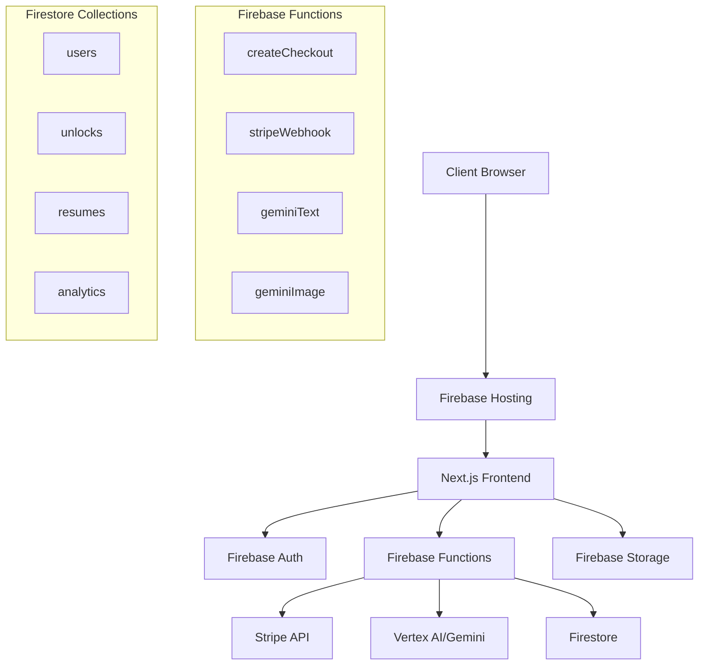

# 📋 Trade Hustle Resume Builder - Project Design Requirements (PDR)

**Document Version:** 1.0  
**Date:** October 13, 2025  
**Project:** Trade Hustle Resume Builder  
**Repository:** [d3vtradehustle-resume-builder](https://github.com/tradehustle88/d3vtradehustle-resume-builder)

---

## 🎯 Executive Summary

The Trade Hustle Resume Builder is a specialized AI-powered platform designed to help trade professionals create industry-optimized resumes. Built with Next.js 14, Firebase, and Stripe integration, it offers a seamless user experience from payment to resume generation using advanced AI capabilities.

---

## 📊 Project Specifications

### **1. Core Requirements**

#### **Functional Requirements**
- **FR-001**: AI-powered resume content generation using Gemini 2.5 Flash
- **FR-002**: Stripe payment integration ($47 one-time fee)
- **FR-003**: Firebase authentication (email/password + Google sign-in)
- **FR-004**: ATS-optimized resume templates for trade industries
- **FR-005**: PDF export functionality with professional formatting
- **FR-006**: Real-time preview and editing capabilities
- **FR-007**: Trade-specific content library and templates
- **FR-008**: Responsive design for mobile/desktop compatibility

#### **Non-Functional Requirements**
- **NFR-001**: 99.9% uptime reliability
- **NFR-002**: Sub-2 second page load times
- **NFR-003**: PCI DSS compliance for payment processing
- **NFR-004**: GDPR/CCPA compliant data handling
- **NFR-005**: Scalable to 10,000+ concurrent users
- **NFR-006**: SEO optimized with Core Web Vitals compliance

### **2. Technical Architecture**

#### **Frontend Stack**
```
Framework: Next.js 14.2.5 (App Router)
Runtime: Node.js 20.x
Language: TypeScript 5.9.2
Styling: Tailwind CSS 3.4.1
UI Components: Custom React components
Animations: Framer Motion 12.23.19
Fonts: Anton (headers), Merriweather (body)
```

#### **Backend Stack**
```
Platform: Firebase Functions v6.x (Gen2)
Runtime: Node.js 20
Language: JavaScript (ES Modules)
Database: Firestore NoSQL
Authentication: Firebase Auth
Storage: Firebase Storage
AI: Google Vertex AI (Gemini models)
Payment: Stripe SDK v16.x
```

#### **Infrastructure**
```
Hosting: Firebase Hosting
CDN: Firebase CDN (Global)
Functions: Firebase Functions (us-central1)
Database: Firestore (Multi-region)
Storage: Firebase Storage (Global)
Analytics: Google Analytics 4
Monitoring: Firebase Performance
```

### **3. System Architecture**



### **4. Data Models**

#### **User Document**
```typescript
interface User {
  uid: string
  email: string
  displayName?: string
  photoURL?: string
  provider: 'email' | 'google.com'
  createdAt: Timestamp
  lastLoginAt: Timestamp
  subscription: {
    active: boolean
    purchaseDate?: Timestamp
    stripeCustomerId?: string
  }
}
```

#### **Resume Document**
```typescript
interface Resume {
  id: string
  userId: string
  title: string
  trade: string
  content: {
    personalInfo: PersonalInfo
    experience: Experience[]
    skills: string[]
    certifications: Certification[]
    education: Education[]
  }
  template: string
  createdAt: Timestamp
  updatedAt: Timestamp
  status: 'draft' | 'completed' | 'exported'
}
```

### **5. Security Requirements**

#### **Authentication & Authorization**
- Firebase Authentication with email/password and Google OAuth
- JWT token validation for all protected routes
- Role-based access control (user, admin)
- Session management with secure token refresh

#### **Data Protection**
- HTTPS-only communication (TLS 1.3)
- Data encryption at rest (Firestore native)
- PII anonymization in analytics
- GDPR-compliant data deletion

#### **Payment Security**
- PCI DSS Level 1 compliance via Stripe
- Webhook signature verification
- Secure API key management via Firebase Secrets
- No sensitive payment data stored locally

### **6. Performance Requirements**

#### **Frontend Performance**
- First Contentful Paint: <1.5s
- Largest Contentful Paint: <2.5s
- Cumulative Layout Shift: <0.1
- First Input Delay: <100ms
- Time to Interactive: <3.5s

#### **Backend Performance**
- API response time: <500ms (95th percentile)
- Function cold start: <2s
- Database query time: <200ms
- AI generation time: <10s per request

### **7. Scalability Requirements**

#### **Horizontal Scaling**
- Firebase Functions auto-scaling
- Firestore multi-region replication
- CDN edge caching
- Static asset optimization

#### **Vertical Scaling**
- Function memory: 512MB-2GB adaptive
- Concurrent function instances: 1000+
- Database connections: Auto-managed
- Storage bandwidth: Unlimited

### **8. Monitoring & Analytics**

#### **Application Monitoring**
- Firebase Performance Monitoring
- Google Analytics 4 integration
- Custom event tracking
- Error reporting and alerting

#### **Business Metrics**
- Conversion rates (visitor → customer)
- Resume completion rates
- User engagement metrics
- Revenue tracking and forecasting

### **9. Compliance & Legal**

#### **Data Privacy**
- GDPR Article 17 (Right to Erasure)
- CCPA compliance
- Privacy policy implementation
- Cookie consent management

#### **Accessibility**
- WCAG 2.1 AA compliance
- Screen reader compatibility
- Keyboard navigation support
- High contrast mode support

### **10. Deployment Pipeline**

#### **Development Workflow**
```bash
# Local Development
npm run dev (Next.js)
firebase emulators:start

# Testing
npm run test
npm run type-check
npm run lint

# Build & Deploy
npm run build
firebase deploy --only hosting,functions
```

#### **CI/CD Pipeline**
- GitHub Actions integration
- Automated testing on PR
- Staging environment deployment
- Production deployment approval gates

---

## 📈 Success Metrics

### **Technical KPIs**
- **Uptime**: 99.9% availability
- **Performance**: Core Web Vitals "Good" rating
- **Security**: Zero data breaches
- **Scalability**: Handle 10x traffic growth

### **Business KPIs**
- **Conversion Rate**: 15% visitor-to-customer
- **User Satisfaction**: 4.5+ star rating
- **Revenue Growth**: 25% month-over-month
- **Market Penetration**: 10% of trade professional market

---

## 🔮 Future Roadmap

### **Phase 2: Enhanced AI Features**
- Multi-language resume generation
- Industry-specific optimization
- Interview preparation tools
- Skills gap analysis

### **Phase 3: Platform Expansion**
- Mobile app development
- Enterprise B2B solutions
- Integration with job boards
- Advanced analytics dashboard

### **Phase 4: Market Expansion**
- International market entry
- Additional professional verticals
- White-label solutions
- API marketplace

---

*This PDR serves as the foundational specification for the Trade Hustle Resume Builder platform, ensuring alignment between technical implementation and business objectives.*